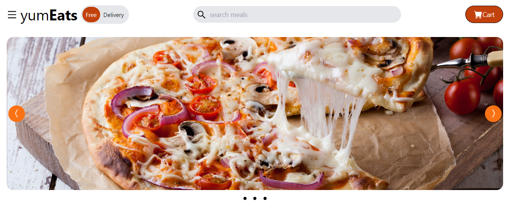

# YumEats - React-based Food Delivery Website

YumEats is a modern and user-friendly food delivery website built with React, Tailwind CSS, Redux, React Icons, and React Splide.

## Technologies Used

- **React.js**: A powerful JavaScript library for building user interfaces.
- **Tailwind CSS**: A utility-first CSS framework that makes styling your application a breeze.
- **Redux**: A state management library for handling application data and state.
- **React Icons**: A set of customizable icons for your React application.
- **React Splide**: A responsive, touch-friendly slider/carousel component for React.

## Features

- Browse a wide variety of restaurants and cuisines.
- Search for your favorite dishes and restaurants.
- Place orders with ease and track their delivery status.
- View detailed restaurant and menu information.
- Secure payment processing for a seamless checkout experience.

## Feedback

We welcome your feedback and suggestions to help us improve YumEats. Please feel free to [create an issue](https://github.com/your-username/yumeats/issues) or reach out to us via email at [contact@yumeats.com](mailto:contact@yumeats.com).

## Contributions

We appreciate contributions from the open-source community to make YumEats even better. To contribute, please follow these steps:

1. Fork the repository.
2. Create a new branch for your feature or bug fix.
3. Make your changes and commit them.
4. Push your changes to your fork.
5. Create a pull request to the `main` branch of this repository.

Please make sure to follow our [code of conduct](CODE_OF_CONDUCT.md) and [contribution guidelines](CONTRIBUTING.md).

Happy coding and bon appétit!
